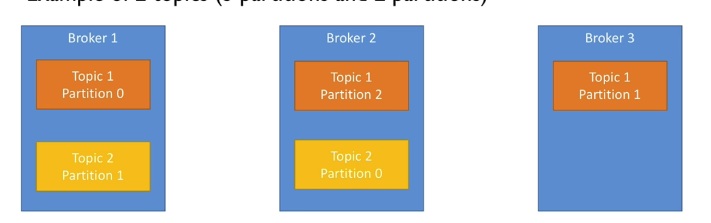
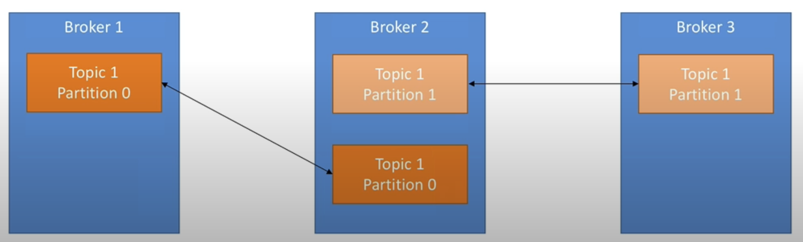
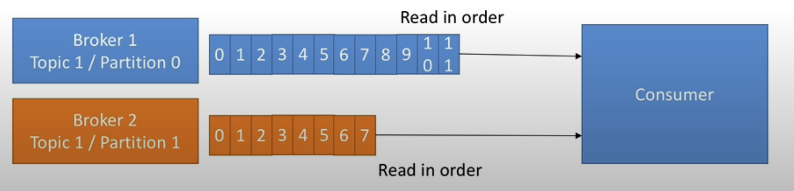
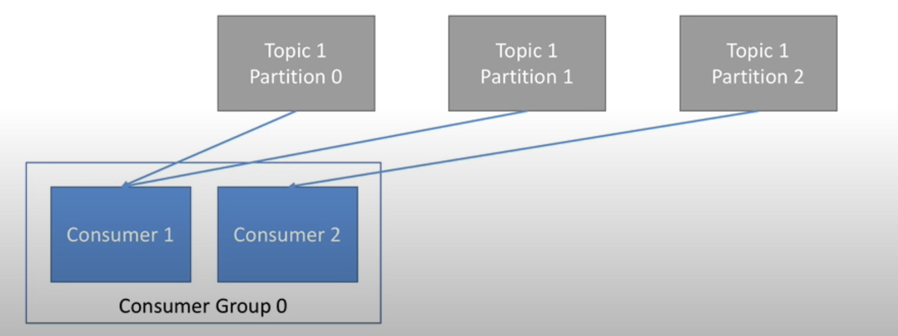
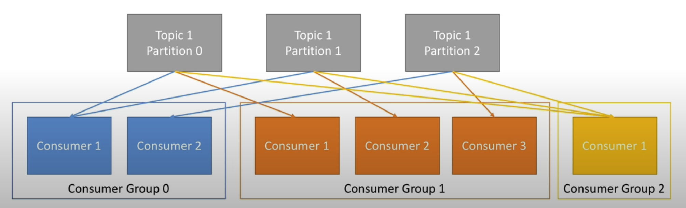

# Kafka

Topics are streams of data, you can have multiple topics in each broker.
Topics are split into partitions with each partition being ordered and each element in the partition gets an incremental ID called offset.
offsets between partitions are not ordered.
There are multiple brokers, each may contain a replica of your topic and the partitions, this is for fault tolerance.
A kafka cluster is composed of multiple brokers (normally 3+)

When a producer streams data to a topic, it can wait for acknowledgements if it is setup this way. There are 3 types:

- no acks - meaning producer wont wait for topic to reply with any acks, this is good for super low latency but can be risky
- 1 ack - the producer waits for the topic in the leader broker to reply
- all acks - the producer waits for the lead broker to reply and all followers to also return an ack, the follower brokers are the ones that will replicate
  the data of the lead broker topic as soon as the data lands in the lead broker, once it is replicated it will then reply with the ack.
  With kafka, once you connect to one broker, you are connected to all brokers.
  Data within topics are held in their partition temporarily for up to 1 week before being wiped.

When you write data to a topic, it will go randomly to a partition in the topic, however if you provide a key it will go to a single partition that is assigned to the key, this allows you to keep ordering.

## Kafka replication

At any time only one broker can be a leader for a given partition, the other brokers will synchronize to it.

---

Consumer will read in order for each partition, it only needs to specify the topic name and one broker to connect to and kafka will automatically take care of pulling data from the correct brokers, as once you are connected to one broker in kafka you are connected to all of them.
A consumer will read both partition 1 and 2's data in parallel when it is consuming from the same topic, but in order per partition.

## Consumer groups

Consumers read data in consumer groups.
Each consumer within a group reads from exclusive partitions, i.e. you cannot have 2 consumers reading from the same partition.
You can also not have more consumers than partitions being read from, otherwise some consumers will be inactive.

## Consumer offsets (when a consumer dies and recovers)

Kafka stores consumer offsets in a topic named `__consumer_offsets`. When a consumer has processed data it constantly commits offsets to that topic. This means that if the consumer dies, it can pick up the feed by continuing off from when the last offset was committed to the `__consumer_offsets` topic.
