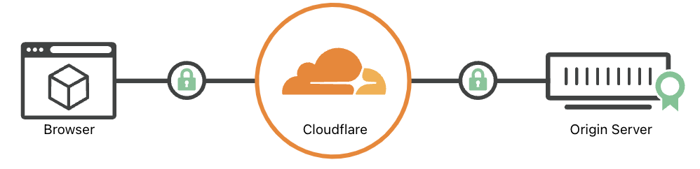
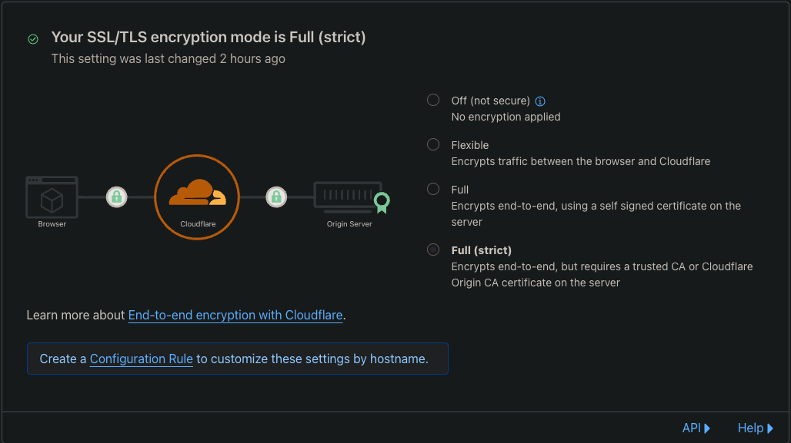

# Nginx ingress with Cloudflare origin SSL/TLS

I had an issue where my application was exposed through an nginx ingress type, but could not connect it to my cloudflare website. This is because cloudflare uses a self-signed SSL certificate to connect from their servers to yours. You will need to incorporate these to [connect your ingress controller to cloudflare.](https://trafi9.github.io/documentation/kubernetes/cloudflare/connectingIngressToCloudflareDomain/)

## How it works

Using the below diagram, the browser (you) connects to cloudflare, then cloudflare servers connect to your origin server (your webserver) and it uses its own SSL certificate to ensure it's encrypted, then it communicates back to cloudflare then to you.



We create a certificate that acts as a norma SSL certificate as far as cloudflare is concerned, however this one is self siged.

We then download a pem file from Cloudflare which enabled client certificate authentication, which prevents people accessing the application if they don't have the certificate. Pretty much ensures access can only be made via cloudflare.

## Creating SSL Certificate

**note DNS Settings**
You **must** set your DNS setting for the domain (eg: `tpm.talhaprojects.com`) to use `proxied` otherwise this wont work

In cloudflare, select your domain then navigate to **SSL/TLS** > **Origin server**

Enable **Authenticated Origin pulls**

Click `Create Certificate`

Select **Generate private key and CSR with cloudflare** and select **RSA (2048)**

Fill out the domain name

You can select how long you want the certificate to be valid for, default is 15 years

### Create the files locally

Once you've clicked `Create` from the previous screen, you are presented with 2 text boxes

- Origin Certificate
- Private Key

Copy the **Origin certificate** in to a file called `cf.crt`

Copy the **Private key** in to a file called `cf.key`

## Enable Strict SSL

Click **Overview** on the `**SSL/TLS**` navbar

Under the top box, there is an option called `Full (strict)`, enable this



Download the [Cloudflare Origin CA root certificate](https://developers.cloudflare.com/ssl/origin-configuration/origin-ca/#cloudflare-origin-ca-root-certificate)

```shell
wget https://developers.cloudflare.com/ssl/static/authenticated_origin_pull_ca.pem
```

## Create kubernetes secrets

### Create cloudflare TLS Secret

This secret is used to ensure that requests are real and are coming from the cloudflare network

```shell
kubectl create secret generic cloudflare-tls-secret --from-file=ca.crt=./authenticated_origin_pull_ca.pem
```

### Create SSL Certificate

```shell
kubectl create secret tls cloudflare-origin-server --key cf.key --cert cf.crt
```

## Configure nginx ingress

Configure the below lines for your ingress.

Make sure to chang `<namespace>` to the namespace where the secret is created

```yaml hl_lines="5-8 26"
apiVersion: networking.k8s.io/v1
kind: Ingress
metadata:
  annotations:
    nginx.ingress.kubernetes.io/auth-tls-pass-certificate-to-upstream: "true"
    nginx.ingress.kubernetes.io/auth-tls-secret: <namespace>/cloudflare-tls-secret
    nginx.ingress.kubernetes.io/auth-tls-verify-client: "on"
    nginx.ingress.kubernetes.io/auth-tls-verify-depth: "1"
  name: name
spec:
  ingressClassName: nginx
  rules:
    - host: <host-from-cloudflare>
      http:
        paths:
          - backend:
              service:
                name: <service-name>
                port:
                  number: <service-port>
            path: /
            pathType: Prefix
  tls:
    - hosts:
        - <host-from-cloudflare>
      secretName: cloudflare-origin-server
```

Once created, get the ingress IP

```shell
kubectl get ingress <name>
```

Output:

```shell
NAME            HOSTS     ADDRESS         PORTS     AGE
basic-ingress   *         203.0.113.12    80        2m
```

You should now set your DNS to use this IP address

**note** : This page was sourced from [here](https://documentation.breadnet.co.uk/kubernetes/nginx-ingress/nginx-ingress-with-cloudflare-origin-server-ssl-tls/#configure-nginx-ingress)
