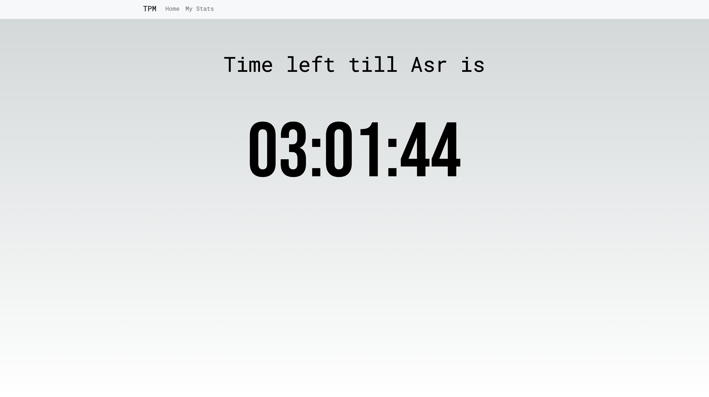
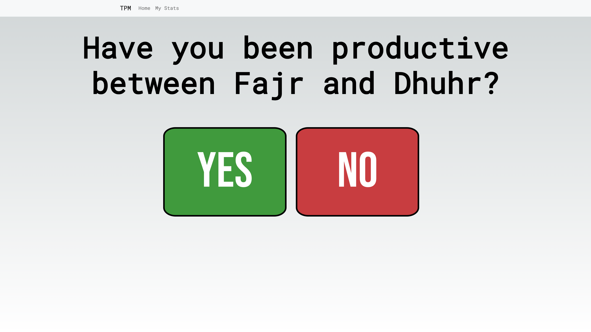
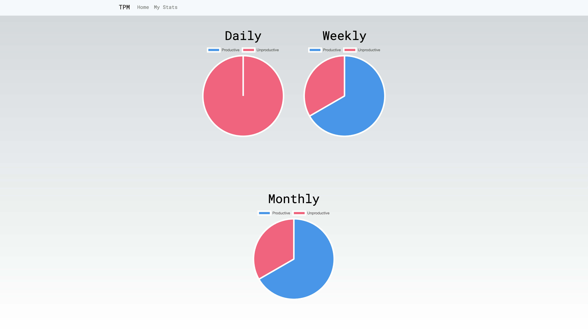

# What is TPM?

If your lucky, its still up at [tpm.talhaprojects.com](https://tpm.talhaprojects.com)

TPM, short for "The Productive Muslim," is a handy productivity tool that's inclusive for all users. It's a straightforward way to monitor your daily productivity without any fuss. Instead of complex metrics, TPM keeps it simple with a basic yes/no question. Because this question is boolean, it is really up to the user and their imagination to track whatever they want e.g. Instead of _have you been productive?_ You can change it to _Have you been happy?_ or _Have you stayed on track with your diet so far?_.

## How does it track productivity?

TPM operates in sync with Muslim prayer times, happening five times daily. It initiates a countdown to the next prayer and simply asks you to reflect on your productivity when it's time. You provide your answer, it's recorded, and then it's back to the countdown. With up to four check-ins available each day, TPM helps you stay on track. And if you ever want to review your progress, just take a glance at your submissions throughout the day, week, or month.

### Countdown page (main page)

This is the main page, which displays a countdown till the next prayer time

### Productivity question when timer expires

Once the timer runs out, the user gets asked if they've been productive between the last 2 prayers. This info is stored in the backend with prayer timestamps, which gives me the stats to be able to count the time spent being productive/unproductive and possibly visualise that in the future.

### Users stats view

Clicking `My Stats` in the nav bar takes the user to a page where they can see a simple visualisation of how productive they've been throughout different time periods.

## Why prayer times?

I chose to go with muslim prayer times because it breaks down the day into 5 segments and allows me to dynamically split up the day.
